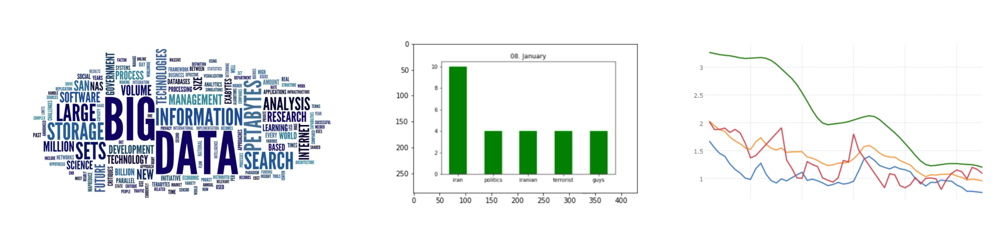
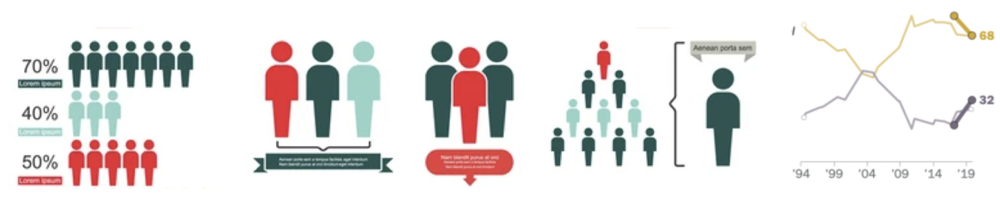

## Title

Assessing the stance of US politicians on the major problems

## Abstract

Quotebank is a dataset that contains more than 178M quotations extracted from English articles. Dataset of such size could be utilized for the detection of the most popular and influential topics during different periods of time. Furthermore, categorization into the fixed number of areas may be performed (healthcare, drug addiction, education, economy, climate change, racism, illegal immigration, terrorism, sexism, unemployment) in order to analyze the topics on a higher level. The stance on such topics taking into account the political party, age, nationality, academic degree, and other features, may be further assessed using sentiment analysis. The obtained results will be finally compared with the previous social/political research [1] on the views of major US problems of 2019 depending on the previously mentioned indicators.

## Research question

1. Which topics and problems do politicians address the most?
2. How does the popularity of these topics change over time?
3. Is it possible to categorize these topics to further assess their importance on a higher level (e.g. affordability of healthcare, drug addiction, college education, budget issues, climate change)?
4. How much does each party in the US address these problems?
5. What is the attitude of different political parties towards these topics?
6. Are there any other correlations between speakers and problems they address (e.g. age, nationality, academic degree)?
7. Can we relate the results we obtained from the Quotebank dataset to some previous research?

## Additional datasets

**_Wikidata_**

Spreaker attributes that are of the greatest interest for our research are date of birth, occupation, political party, academic degree, nationality, and religion. Wikidata will be used for this purpose in order to enrich Quotebank data. It will be used in the form of a precomputed dataset provided by the ADA staff or using the Wikidata API.

## Milestones and methods

**_Data cleaning and initial filtering_** 

(demonstrated in notebook **_basic_cleaning_and_filtering_**)

Here we demonstrate the project milestones and methods we used to get the solutions to the mentioned milestones:

- Filter out the quotations from the years of interest
- Drop quotations with the most probable speaker being unidentified
- The mapping between the speaker and Wikidata Qid may not be unique in the Quotebank dataset; Evaluate different approaches for disambiguation:
  - Exclude all such speakers
  - Take the Qid with the smallest value (more influential people are more likely to have been given Qid earlier)
  - Use some other heuristic (e.g. take the first Qid)
- Consider removing near-duplicates of quotations

**_Data augmentation and final filtering_**

(demonstrated in notebook **_basic_cleaning_and_filtering_**)

- Enrich Quotebank dataset with features from Wikidata: add speaker&#39;s age, nationality, political party (at the time of the quote), academic degree, ethnicity, etc.
- Filter out the quotations from political figures from the Democratic and Republican parties

**_Keywords extraction_**

- Extracting _k_ most important keywords of all quotations using _KeyBERT_ [2] (demonstrated in notebook **_keywords_**)
  - Take different values of _k_ into consideration, as well as the possibility of extracting n-grams instead of single words

**_Data analysis_**

- Clustering of quotes based on the distance of keyword (or quote in a whole) embeddings (using _Hugging Face SentenceTransformer_ [5], as well as _sklearn KMeans and PCA_) to identify major topics and problems
- Detecting important topics/words by keeping track of keywords over a specified period of time (demonstrated in notebook **_keywords_**), manually classifying them into certain categories of problems
  - Consider different time periods to get the most relevant results (week, month)
- Sentiment analysis towards important topics depending on the indicators such as age, nationality, political party, academic degree, ethnicity (demonstrated in notebook **_sentiment\_analysis_**)
  - NLTK SentimentAnalyzer [3], Aspect Based Sentiment Analysis [4] (although this method offers an option to provide target/aspect to determine the sentiment towards, it is pretty time consuming)
- Examples (not an exhaustive list) from the previous research [1] which should be comparatively analyzed with the extracted data:
  - _Illegal immigration is seen as a major problem by most older Republicans_
  - _Black adults are far more likely than whites to view racism, economic inequality as major problems_
  - _Climate change viewed as a major problem by more white and Hispanic Democrats than black Democrats_

**_Story creation_**

- Important topics and trending words can be represented in different manners: word clouds, histograms, graphs which can also be animated (demonstrated in notebook **_keywords_**)

- Creating infographics and graphs with data about stances on certain topics

- Comparative analysis between the analyzed data and findings from previous political research [1]

## Proposed timeline

The planned work on the project has been divided into 4 weeks and is shown in the table.

| Week | Milestone | Responsibility \* |
| --- | --- | --- |
| 1 | Data cleaning and initial filtering | J, M |
| 2 | Data augmentation and final filtering | G, V |
| 2 | Keywords extraction | V |
| 3, 4 | Data analysis | Clustering, Sentiment analysis: J, G Keyword frequency: V, M  Examples to compare from a study: J, G, M, V |
| 4 | Story creation | Important topics and keywords: V, M  Infographics: J, G  Comparative analysis: J, G, M, V |

\* G = Gojko, J = Jana, M = Miloš, V = Vuk

## References

[1] [https://www.pewresearch.org/politics/2019/12/17/views-of-the-major-problems-facing-the-country/](https://www.pewresearch.org/politics/2019/12/17/views-of-the-major-problems-facing-the-country/)

[2] [https://github.com/MaartenGr/KeyBERT](https://github.com/MaartenGr/KeyBERT)

[3] [https://www.nltk.org/howto/sentiment.html](https://www.nltk.org/howto/sentiment.html)

[4] [https://github.com/ScalaConsultants/Aspect-Based-Sentiment-Analysis](https://github.com/ScalaConsultants/Aspect-Based-Sentiment-Analysis)

[5] [https://huggingface.co/sentence-transformers](https://huggingface.co/sentence-transformers)